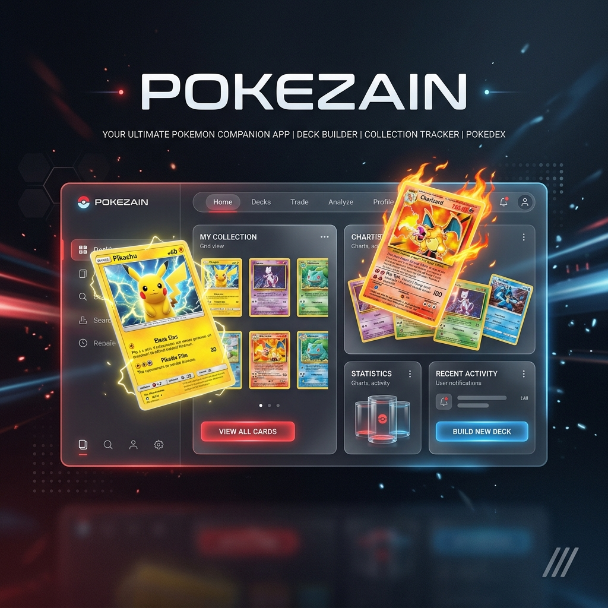

# 🔴 Pokezain - O Portal Definitivo Pokémon



<p align="center">
  
  
  
  
</p>

---

## 🌟 Sobre o Projeto

O **Pokezain** é uma plataforma premium desenvolvida para entusiastas do universo Pokémon. Combinando uma estética moderna de **Glassmorphism** com funcionalidades robustas de gerenciamento de conteúdo, o portal oferece uma experiência imersiva e fluida.

Diferente de enciclopédias comuns, o Pokezain integra APIs globais (PokeAPI, MyAnimeList) com um banco de dados proprietário no Firebase, permitindo a curadoria de ROMs, mods (Pixelmon/Cobblemon), notícias e séries em um único lugar.

---

## 🚀 Funcionalidades Principais

### 📱 Experiência do Usuário (UX/UI)
- **Design Glassmorphism:** Interface ultra-moderna com efeitos de desfoque, transparência e profundidade.
- **Navegação SPA Customizada:** Sistema de rotas via estado que mantém a URL limpa e a navegação instantânea.
- **Micro-interações:** Animações suaves alimentadas por Framer Motion.
- **Filtros Avançados:** Pesquisa global e filtragem por tipos/gerações em tempo real.

### 🛠️ Gestão de Conteúdo
- **Dashboard Administrativo:** Painel completo para gerenciar animes, filmes, notícias e links de download.
- **Autenticação Firebase:** Sistema seguro de login para administradores e usuários.
- **Pokedex Atômica:** Dados detalhados de cada Pokémon, incluindo status base, habilidades e sprites oficiais.

---

## 🛠️ Tecnologias e Ferramentas

| Categoria | Tecnologia |
| :--- | :--- |
| **Core** | [React](https://reactjs.org/) + [Vite](https://vitejs.dev/) |
| **Backend** | [Firebase](https://firebase.google.com/) (Auth, Firestore, Storage) |
| **Estilização** | Vanilla CSS (Variáveis Nativas, Modern Layouts) |
| **Animações** | [Framer Motion](https://www.framer.com/motion/) |
| **Ícones** | [Lucide React](https://lucide.dev/) |
| **APIs** | [PokeAPI](https://pokeapi.co/), [Jikan API](https://jikan.moe/) |

---

## ⚙️ Instalação e Configuração

Siga os passos abaixo para rodar o projeto em sua máquina local:

1. **Clone o repositório:**
   ```bash
   git clone https://github.com/mathgb10/Pokezain.git
   ```

2. **Instale as dependências:**
   ```bash
   npm install
   ```

3. **Configure as Variáveis de Ambiente:**
   Crie um arquivo `.env` na raiz e adicione suas credenciais do Firebase:
   ```env
   VITE_FIREBASE_API_KEY=sua_api_key
   VITE_FIREBASE_AUTH_DOMAIN=seu_projeto.firebaseapp.com
   VITE_FIREBASE_PROJECT_ID=seu_projeto
   VITE_FIREBASE_STORAGE_BUCKET=seu_projeto.appspot.com
   VITE_FIREBASE_MESSAGING_SENDER_ID=seu_id
   VITE_FIREBASE_APP_ID=seu_app_id

   # Credenciais Administrativas (Para scripts de setup)
   ADMIN_EMAIL=seu-email@admin.com
   ADMIN_PASSWORD=sua-senha-segura
   ```

4. **Inicie o servidor:**
   ```bash
   npm run dev
   ```

---

## 🔒 Regras de Segurança (Firestore)

Para garantir a integridade dos dados, certifique-se de aplicar as seguintes regras no seu console Firebase:

```javascript
rules_version = '2';
service cloud.firestore {
  match /databases/{database}/documents {
    function isAdmin() {
      return request.auth != null && 
        get(/databases/$(database)/documents/users/$(request.auth.uid)).data.role == 'admin';
    }

    match /content/{docId} {
      allow read: if true;
      allow write: if isAdmin();
    }
    
    // ... outras regras específicas
  }
}
```

---

## 🤝 Contribuição

Contribuições são o que fazem a comunidade open source um lugar incrível!
1. Faça um **Fork** do projeto
2. Crie uma **Branch** para sua feature (`git checkout -b feature/NovaFeature`)
3. Adicione suas alterações (`git commit -m 'Add NovaFeature'`)
4. Faça o **Push** da Branch (`git push origin feature/NovaFeature`)
5. Abra um **Pull Request**

---

<p align="center">
  Desenvolvido com ❤️ por <a href="https://github.com/mathgb10">Matheus (mathgb10)</a>
</p>